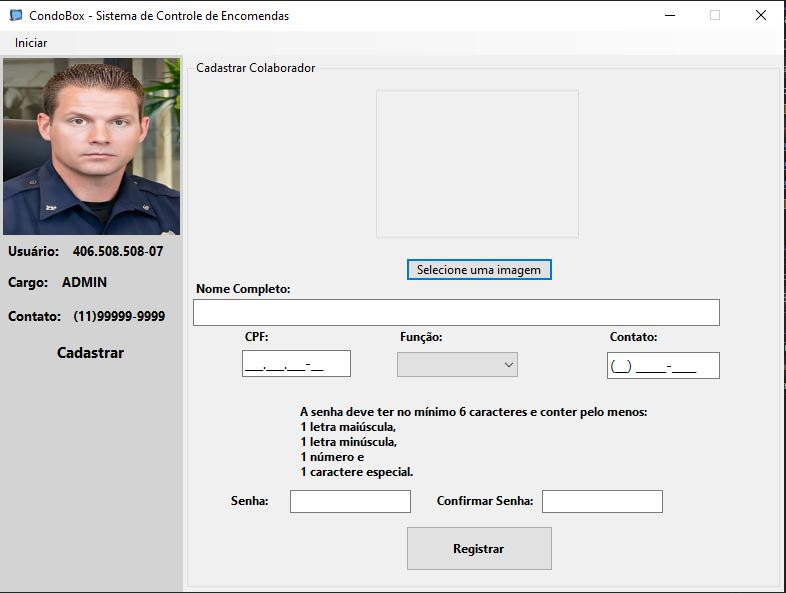
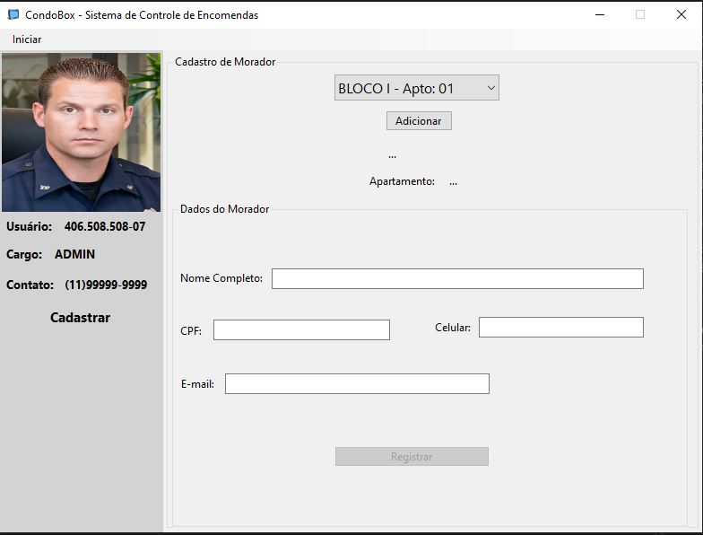
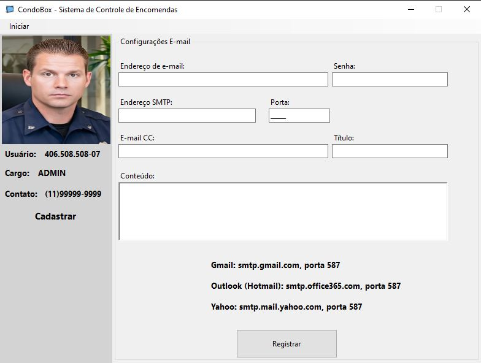
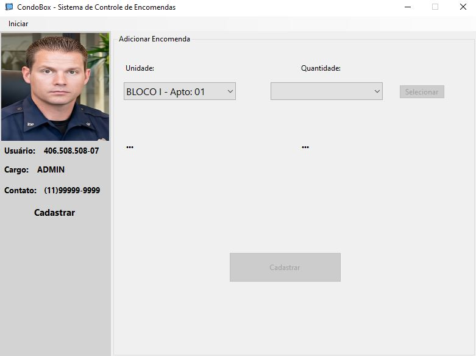

# CondoBox - Email Notification System

## 📌 Project Overview

This project was developed as part of the **Software Engineering** course.  
The main goal is to **notify residents via email** when their **packages arrive at the building's front desk**.

## ✉️ Main Features

- Register incoming packages
- Send email notifications to residents
- Display package information in a user-friendly interface

## ✅ Prerequisites

To run this project, make sure you have the following installed on your machine:

- [Microsoft Visual Studio](https://visualstudio.microsoft.com/) (with .NET desktop development workload)
- [.NET 8 SDK](https://dotnet.microsoft.com/en-us/download/dotnet/8.0)
- [Entity Framework Core Tools](https://learn.microsoft.com/en-us/ef/core/cli/dotnet) (`dotnet-ef`)

Install EF Core Tools using the following command:

```bash
dotnet tool install --global dotnet-ef
```

## 🛠️ Setting Up the Database

Before running the application, open the terminal in the project directory and run:

```powershell
Update-Database
```

This will create a new SQLite database file in a new directory at:

```
C:\InfraCondoBox\
```

> ⚠️ Make sure your system allows file creation in the root of drive `C:`.

## 🚀 How to Run

After building the application in Visual Studio, navigate to the following path:

```
src/CondoBox.App/bin/Release/net8.0-windows/CondoBox.App.exe
```

Double-click the `.exe` file to start the application.

## 🖼️ Screenshots

Below are some screenshots of the application:

  
  




> 📂 To display the images correctly, place your `.png` or `.jpg` files inside an `images/` folder in the root of your repository.

## 🧰 Technologies Used

- C# with .NET 8.0 (Windows Forms)
- Entity Framework Core
- SQLite
- SMTP for sending emails

Feel free to contribute or suggest improvements!

felipe.fends@gmail.com
